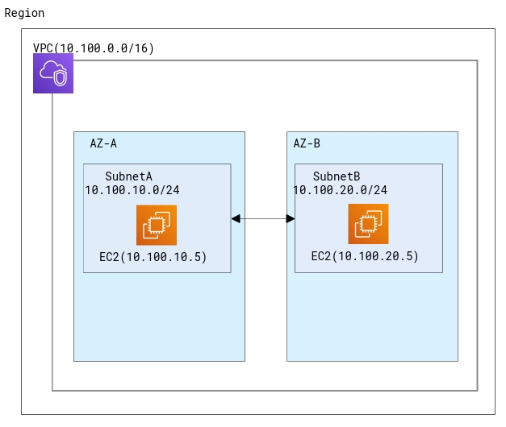

### Introductory to cloud
### 10.13

---

社内資料でクラウド利用によるメリットが幾つか挙げられていました。  
でも、クラウドの凄いところはこれだけではないんです。

---

クラウドサービスを利用することで自宅や職場にいながら世界中のエリアにサービスを構築することができます。  
これを活用することで簡単にBCPが実現できたりします。  
**出張いらず！！**

---

クラウドで開発する上で世界中のどのエリアにサービスを構築するかという考え方は重要なので、本資料ではこの辺りを深堀していきます。

---

AWS、Azure、GCPではエリアは以下の単位に分かれます。
- リージョン
- アベイラビリティゾーン(AWS) / 可用性ゾーン(Azure) / ゾーン（GCP）  
※呼び方が違うだけで考え方は一緒です。

---

### リージョン
- データセンタが集積されている物理的ロケーション
- 例えば東京リージョン、大阪リージョンなど

>>>

例えばAWSリージョンのロケーションは以下の通り。  
[AWSのサイトより](https://aws.amazon.com/jp/about-aws/global-infrastructure/regions_az/)

---

### ゾーン
- リージョン内に配置されるデータセンタ
- 1リージョンあたり3ゾーンが一般的ですが、異なるケースもあります。

>>>

リージョンとゾーンの関係  
1つのゾーンは物理的なデータセンタになります。

---

### ベンダ間の比較

増え続けているので定かではないですが。。

| ベンダ | リージョン | ゾーン |
| --- | --- | --- |
| AWS | 24 | 77 |
| Azure | 55 | ? |
| GCP | 24 | 73 |

---

### リージョンやゾーンによる違い
- リージョンによって新規サービスの利用開始時期が異なります。  
- 同じサービスでもリージョンによって料金が変わります。
- 国による法律が適用されてデータの取り扱いを考慮する必要がある場合があります。

---

### どのリージョンを選択すべきか
- 要件にもよりますが、利用ユーザから最も近いリージョンを選択することが一般的です。
- 物理的に距離が離れると通信も時間がかかります。

---

### ほとんどのサービスは構築時にリージョンとゾーンを選択します。
サービスによってリージョン単位に構築されるものや、ゾーン内に構築されるものがあります。  
リージョンを跨ぐグローバルなサービスもあります。

---

#### リージョンとゾーンの関係を学べたと思うのでIaaSについて触れていきます。

---

### IaaS
- Infrastructure as a Service
- ベンダが基盤を提供して利用者がその基盤を利用するサービス形態です。
- 仮想サーバやネットワークが含まれます。

>>>

サービス形態毎の責任分解　　
  
[Azure相談センターサイトより](https://licensecounter.jp/azure/blog/topics/20170531.html)

---

#### 代表的なIaaS

全て仮想マシンサービスの名称です。

| ベンダ | サービス名 |
| --- | --- |
| AWS | EC2(Amazon Elastic Compute Cloud) |
| Azure | Azure Virtual Machine |
| GCP | Compute Engine |

---

仮想マシンはリージョン、ゾーンのどこに構築されるか。

---

仮想マシンはゾーンに構築されます↓
  
AWSの例ですがAzure,GCPも同じくゾーンに構築されます。

---

#### ネットワーク
- 仮想マシンをゾーンへ構築するためには先にネットワークを構築する必要があります。
- ここからはクラウドベンダ毎に仕様が異なるので個別に説明していきます。

---

### AWS
- AWSではまずVPCと呼ばれるプライベートな仮想ネットワークをリージョンに作成します。
- 次にVPC内にサブネットを作成します。1つのVPC内に複数作成できます。１つのサブネットは1つのAZに構築されます。
- VPC内のサブネットは相互接続が可能なため、これによりAZ間の通信も可能です。

>>>

VPCとサブネット作成時にIPアドレスを割り当てます。  
EC2構築時にはサブネットを選択すると同時にIPアドレスが割り当てられます。  
 

---

